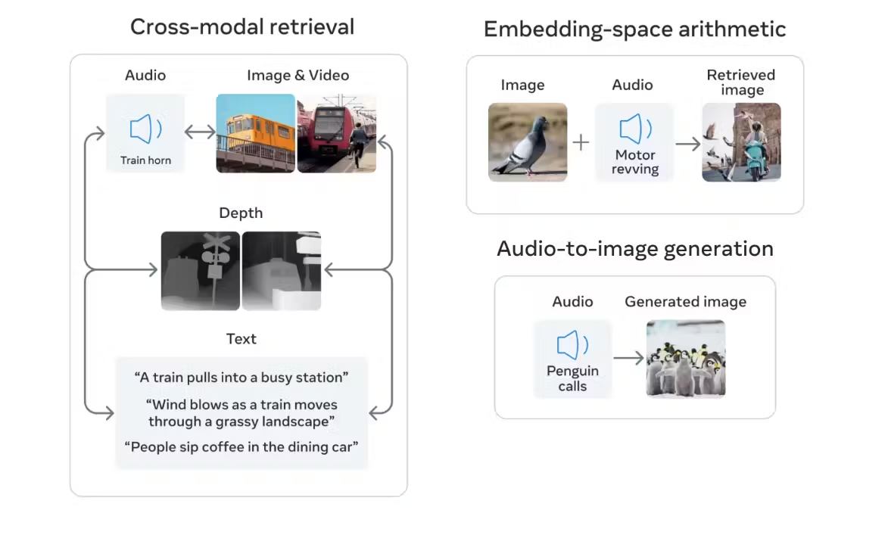

# Multimodal-Product-recommendation Cross Retrieval with Pinecone

**Pinterest: Any-to-Image Product Recommendations Cross Modal Retrieval**
You can search a collection of images using `text`, `audio` or `images`.

## About

## TechStack

## Data

For **Image Descriptions data** Visit here https://www.kaggle.com/datasets/samikshakolhe/pinterest-fashion-dataset 

**Note:** Image Descriptions are created using gemini-pro-vision model.

For **Image and Text Embeddding data created using ImageBind model** Visit this website to download the embeddings pickle file https://www.kaggle.com/datasets/samikshakolhe/pinterest-fashion-imagebind-multimodal-embed-data

## How to Use

## Sample Outputs with 3 modalities

1. Text to Image : Office coats and jackets

2. Image to Image: White Shirt

3. Audio to Image: Shoes in winters

