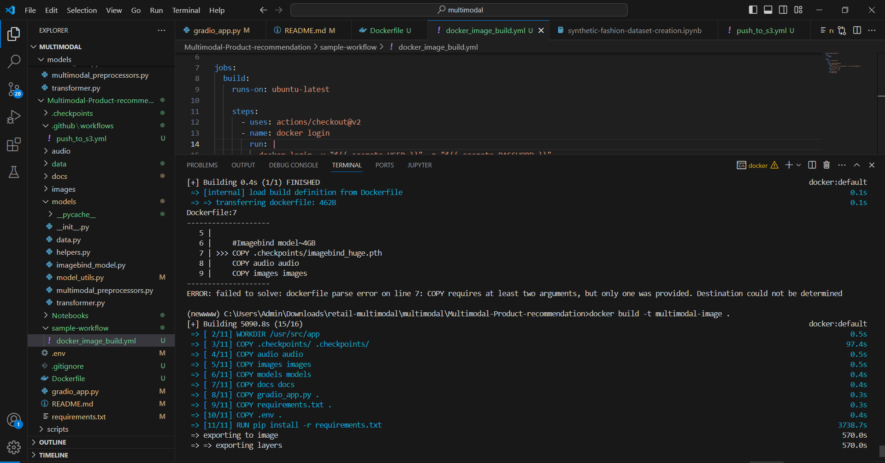
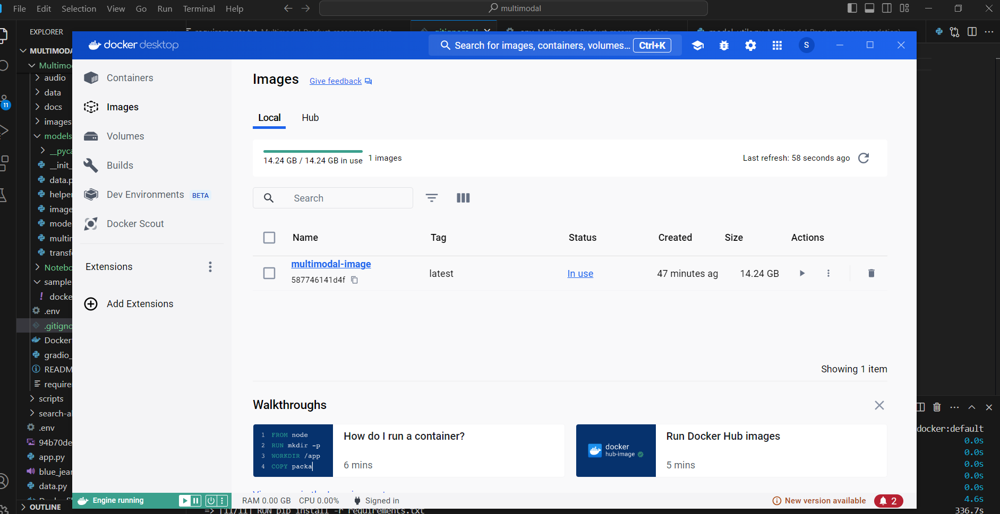

# Multimodal-Product-Recommendation Cross Retrieval with Pinecone

**Pinterest: Any-to-Image Product Recommendations Cross Modal Retrieval**
You can search a collection of images using `text`, `audio` or `images`.


## About


## Code Structure

```
    ├── .github/workflows//
    │   └── push_to_s3.yml
    |
    ├── audio/
    │   ├── (audio files)
    │
    ├── docs/
    │   └── app_info.md
    │
    ├── images/
    │   ├── (sample images)
    │
    ├── data/
    |    └── fashion-cat.json
    |
    ├── doc/
    |    └── APP_README.md
    |
    ├── models/
    │   ├── __init__.py
    │   ├── data.py
    │   ├── helper.py
    │   ├── imagebind_model.py
    │   ├── model_utils.py
    │   ├── multimodal_preprocessors.py
    │   └── transformer.py
    │
    ├── Notebooks/
    │   ├── gemini-description-dataset.ipynb
    │   ├── imagebind-model-download.ipynb
    │   ├── model-inference.ipynb
    │   ├── pinecone-upsert-embeddings.ipynb
    |   └── synthetic-fashion-dataset-creation.ipynb
    |
    ├──sample-workflow
    |   └──docker-image-build.yml
    ├── .env
    ├── .gitignore
    ├── Dockerfile 
    ├── gradio_app.py
    ├── README.md
    └── requirements.txt
```


## TechStack

1. ImageBind Model
2. Generative AI
3. Vector Store: Pinecone
4. Image Embeddings
5. Any-to-Any Image Similarity Search
6. Vision Transformers

## Data

For **Image Descriptions data** Visit here https://www.kaggle.com/datasets/samikshakolhe/pinterest-fashion-dataset 

**Note:** Image Descriptions are created using gemini-pro-vision model.

For **Image and Text Embeddding data created using ImageBind model** Visit this website to download the embeddings pickle file https://www.kaggle.com/datasets/samikshakolhe/pinterest-fashion-imagebind-multimodal-embed-data

## Retrieval with Imagebind and Pinecone from scratch

Note: This code is builted and tested on python==v3.8.19.
1. create a virtual env 
    
    ```
    conda create --name multimodal python=3.8.19
    conda activate multimodal

## How to Run the App

There are two ways to 
1. **Clone the github repository**: follow below steps
    ```
    git clone https://github.com/kolhesamiksha/Multimodal-Product-recommendation.git
    pip install -r requirements.txt
    python gradio_app.py -i <your-pinecone-index> -k <topk>

## How to Use Dockerfile
1. Built the Dockerimage and publish it to docker-hub
    ```
    docker build -t multimodal-image . 



2. Now After publishing to docker-hub, run the below command
    ```
    docker run multimodal-image


## Sample Outputs with 3 modalities

1. Text to Image : Office coats and jackets


2. Image to Image: White Shirt


3. Audio to Image: Shoes in winters


## For more info
Thank you for visiting the application, connect with me in [`linkedin`](https://www.linkedin.com/in/samiksha-kolhe25701/), I love writing blogs on ML/AI/GenAI visit [`blogs`](https://teckbakers.hashnode.dev/)
